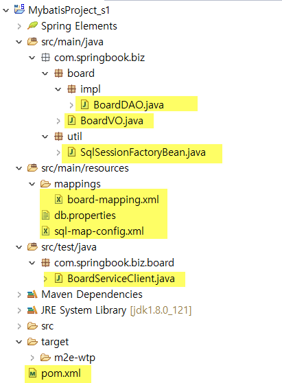

# spring_ex
스프링 공부

## Spring_ex01.zip
- Spring MVC 게시판 (XML기반)

## Spring_ex02.zip
- Spring MVC 게시판 (annotation 기반)

## Spring_ex03.zip
- 프레젠테이션 레이어와 비즈니스 레이어 분리 개발

## Spring_ex04.zip
- 검색기능 추가, 파일업로드 , 예외처리 페이지 만들기 , 다국어 처리(국제화)
- 국제화 전 boardListjsp파일.txt

## Spring_ex05.zip
- mybatis 예제 (spring과 연동x) 

-  
> - pom.xml : 관련 라이브러리 다운
> - board-mapping.xml : SQL Mapper로서 관련 sql문을 입력하는 곳
> - db.properties : DataSource 적는 곳 (dbinfo)
> - sql-map-config.xml : Mybatis 메인 환경 설정 파일/ sql mapper와 db.properties 등등을 연결해준다.
> - SqlSessionFactoryBean.java : Mybatis를 이용하여 DAO를 구현하려면 SqlSession 객체가 필요한데, 그 sqlSession객체를 만들어 주는 곳
> - BoardServiceClient.java: 테스트 
